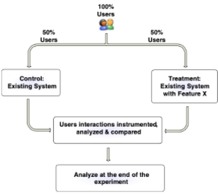

## Methodology and Practices of A/B testing

*Short history:*

- A/B testing, also known as controlled experiment.
- aims originally at evaluating new product strategies and approaches. 
- First theory of controlled experiment was proposed in Sir Ronald A. Fisher's experiments at the Rothamsted Agricultural Experimental Station in England in the 1920s [Yates 1964]. 
- First online A/B testing Boom in the late 1990s with the growth of the internet [Kohavi et el. 2012]. 

*Limitations on A/B testing:*

- It serves as Quantitative metrics, but is lack of explanations. It indicates which variant with which cost is better, but the question "why" is not answered [Nielsen 2005]
- It only measures Short term effects.
- newness effects: newness bias [Hawthorne 2007]
- efforts for implementing newness [Kohavi 2009]
- consistency and parallel experiments [Belle 2002]

*Test approaches:*

- users are randomly exposed to one of two variants
- one variant as contraol group, the other variant as treatment group
- control and treatment [Weiss 1997]:
    1. **single variant:** 
        - time efficient
        - factors interaction can be observed
        - factors combination may give poor user experience
        - analysis and interpretation are diffcult
    2. **multiple variants:**
        - single factor test has many metrics for comparison
	    - time consuming
- Overall Evaluation Criterion (OEC) derived [Roy 2001]: based on which goal need to be achieved and evaluated in metrics.
- Determine statistical method to apply. 
 
 [Kohavi 2009]

 

*References:*

*Kohavi, Ron. et al. Controlled experiments on the web:
survey and practical guide. Data Mining and Knowledge
Discovery. February 2009, Vol. 18, 1, pp. 140-181.*

*Kohavi, Ron, et al. Trustworthy online controlled
experiments: Five puzzling outcomes explained. Proceedings
of the 18th Conference on Knowledge Discovery and Data
Mining. 2012, www.expplatform.com/Pages/PuzzingOutcomesExplained.aspx.*

*Y. Xu, et al. From Infrastructure to Culture: A/B Testing Challenges in Large Scale Social Networks, KDD '15: Proceedings of the 21th ACM SIGKDD International Conference on Knowledge Discovery and Data MiningAugust 2015 Pages 2227–2236https://doi.org/10.1145/2783258.2788602*
